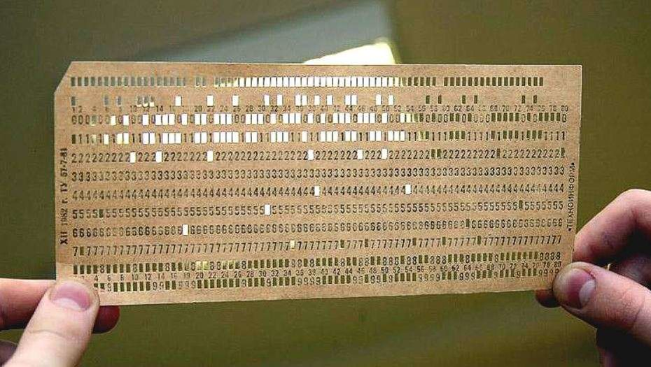
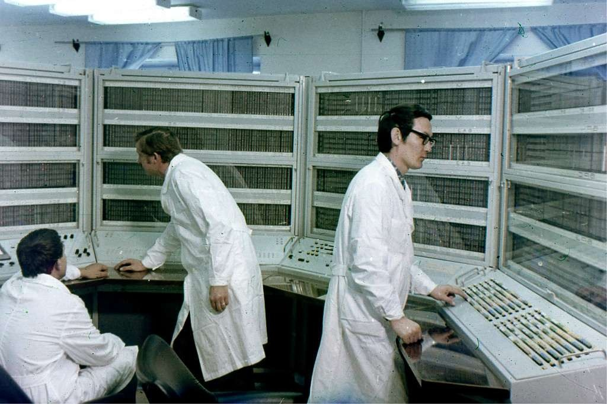
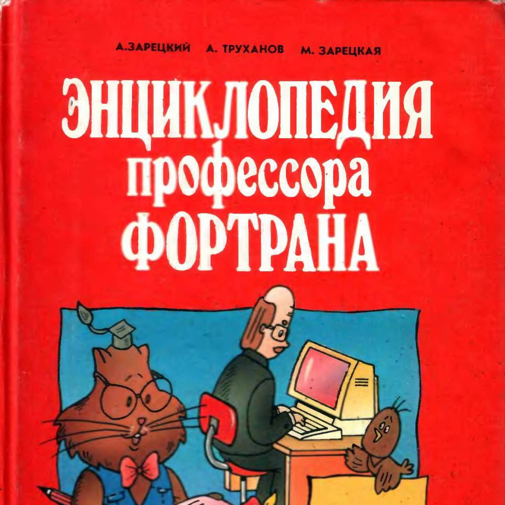
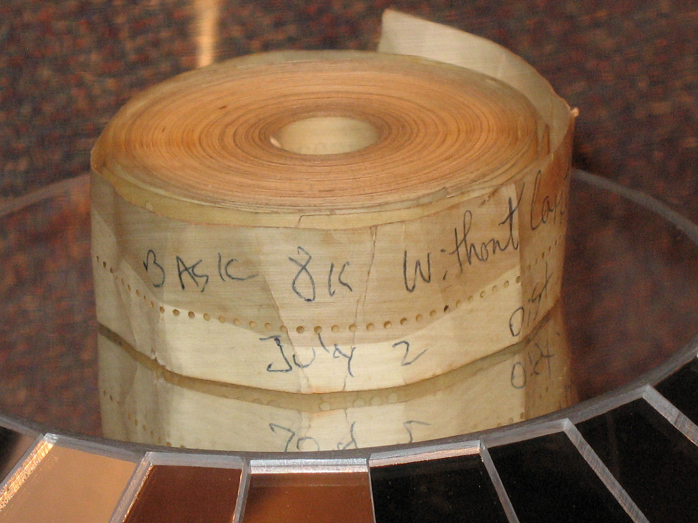

# 1. Языки программирования и некоторые базовые термины.

### Машинный код или двоичный код, ассемблеры

Вплоть до первой половины 60-х годов XX века большая часть программирования производилась на двоичном коде.


Первым языком программирования можно машинный код - "родной язык" компьютера. Для выполнения каждого действия там писались определенные инструкции, перемещавшие биты и байты в памяти. К примеру, вот так выводится приветствие **Hello world** на машинном коде:

```
BB 11 01 B9 0D 00 B4 0E 8A 07 43 CD 10 E2 F9 CD 20 48 65 6C 6C 6F 2C 20 57 6F 72 6C 64 21

10111011 00010001 00000001 10111001 00001101 00000000 10110100 00001110 10001010 00000111
01000011 11001101 00010000 11100010 11111001 11001101 00100000 01001000 01100101 01101100
01101100 01101111 00101100 00100000 01010111 01101111 01110010 01101100 01100100 00100001
```

Данные вводились в компьютеры при помощи перфокарт:



Компьютеры были огромными и слабыми а работали гораздо медленнее, чем самый простой современный телефон.



### Ассемблеры (assemblers)

Языки низкого уровня - языки, работающие с процессором и памятью компьютера напрямую, байт за байтом. Программы на таких языках могут быть максимально быстрыми.

```c
XXXX:0100     mov     bx, 0111h       ; поместить в bx смещение строки HW
XXXX:0103     mov     cx, 000Dh       ; поместить в cx длину строки HW
XXXX:0106     mov     ah, 0Eh         ; поместить в ah номер функции прерывания 10h
XXXX:0108     mov     al, [bx]        ; поместить в al значение ячейки памяти, адрес которой находится в bx
XXXX:010A     inc     bx              ; перейти к следующему байту строки (увеличить смещение на 1)
XXXX:010B     int     10h             ; вызов прерывания 10h
XXXX:010D     loop    0108            ; если cx≠0, то уменьшить cx на 1 и перейти по адресу 0108
XXXX:010F     int     20h             ; прерывание 20h: завершить программу
XXXX:0111 HW  db      'Hello, World!' ; строка, которую требуется напечатать
```

Именно языки системы Assembler позволили подняться хоть немного над уровнем машинных кодов, это были первые шаги в сторону общения с компьютером на человеческом языке.

### "Первое поколение" высокоуровневых языков. Киты 50-х: Фортран, Алгол, Кобол, Лисп и прочие

### Фортран(Fortran)

FORmula TRANslator (1957) - язык, написанный в компании IBM. Язык уже высокого уровня, но очень старенький) Все еще иногда используется "хардкорными" математиками, поскольку почти все математические задачи мелкого и среднего уровня уже давно на нем решены.

```fortran
program Quadratic
  integer :: a, b, c
  real :: d, p1, p2
  complex :: cp2

  read (*, *), a
  if (a == 0) then
    write (*, *) "Not a quadratic equation"
    stop
  end if
  read (*, *) b
  read (*, *) c
  d = b * b - 4 * a * c
  p1 = - b / 2.0 / a
  if (abs(d) < 1.0e-9) then
    write (*, "(A, F8.3)") "x = ", p1
  elseif (d > 0) then
    p2 = sqrt(d) / 2.0 / a
    write (*, "(2(A, F8.3))") "x1 = ", p1 + p2, char(13) // char(10) // "x2 = ", p1 - p2
  else
    cp2 = sqrt(cmplx(d)) / 2.0 / a
    write (*, "(2(A, F8.3, F8.3), A)") "x1 = (", p1 + cp2, ")" // char(13) // char(10) // "x2 = (", p1 - cp2, ")"
  end if
end
```

Этот язык до сих пор встречается в научных кругах. Его наследие легко прослеживается в современных языках: именно в Fortran были впервые применены такие знакомые всем программистам действия, как присваивания, циклы, условные операторы и подпрограммы (модули). Были заложены основы **структурной парадигмы** программирования.

[Статья о Fortran](https://habr.com/ru/post/309914/) 



### Кобол (COBOL)

В первой версии языка Fortran не хватало работы со строками. Он хорошо подходил для вычислений, но львиную долю задач крупных компаний требовалось решать, используя символы. 
В 1959 г. под руководством американской ученой и контр-адмирала флота США Грейс Хоппер создается язык COBOL (англ. COmmon Business Oriented Language), предназначенный, в первую очередь, для разработки бизнес-приложений.

```c
	*> setup the identification division
  IDENTIFICATION DIVISION.
  *> setup the program id
  PROGRAM-ID. HELLO.
  *> setup the procedure division (like 'main' function)
  PROCEDURE DIVISION.
    *> print a string
    DISPLAY 'WILLKOMMEN'.
  *> end our program
  STOP RUN.
```

Язык Cobol был намного более приближен к простому английскому и умел работать с текстом.  


### Алгол (Algol)

В 1958—1960 гг. в Европе активно переживают по поводу американских разработок и в ответ разрабатывают язык Algol (англ. ALGOrithmic Language) - язык, повлиявший практически на все языки следующего десятилетия (Pascal, С и другие). Алгол разрабатывался группой виднейших ученых-математиков и пионеров информатики, в том числе и авторами языков Fortran, Lisp.

Алгол привнес в языки программирования классический цикл **for**, блоки управляющих конструкций и даже идею рекурсии. 

```pascal
procedure Absmax(a) Size:(n, m) Result:(y) Subscripts:(i, k);
    value n, m; array a; integer n, m, i, k; real y;
comment The absolute greatest element of the matrix a, of size n by m
    is transferred to y, and the subscripts of this element to i and k;
begin
		integer p, q;
    y := 0; i := k := 1;
    for p := 1 step 1 until n do
			for q := 1 step 1 until m do
				if abs(a[p, q]) > y then
					begin 
						y := abs(a[p, q]);
            i := p; k := q
          end
end Absmax
```

[Статья про Algol](http://chernykh.net/content/view/209/221/)


### Лисп (Lisp)

В 1958 г. американский информатик Джон Маккарти изобретает язык Lisp (англ. LISt Processing language) - первый язык программирования, который до сих пор является одним из основных средств моделирования различных аспектов искусственного интеллекта. Это один из старейших (наряду с Фортраном и Коболом) используемых по сей день высокоуровневых языков программирования.


Язык List оказал серьезное влияние на большинство современных языков, предложив динамическую типизацию, основы ООП, которая была сформулирована через 15 лет после создания языка, и мощную **функциональную парадигму**. По мнению зубров индустрии является "самым мощным языком". 

```lisp
(defun quadratic-roots-2 (A B C)
  (cond ((= A 0) (string "Not a quadratic equation."))
    (t
    (let ((D (- (* B B) (* 4 A C))))
      (cond ((= D 0) (concatenate 'string "x = " (write-to-string (/ (+ (- B) (sqrt D)) (* 2 A)))))
        (t
        (concatenate 'string (concatenate 'string "x1 = " (write-to-string (/ (+ (- B) (sqrt D)) (* 2 A))))
                             (concatenate 'string "~%x2 = " (write-to-string (/ (- (- B) (sqrt D)) (* 2 A)))))))))))

(let ((A (read))
     (B (read))
     (C (read)))
(format t (quadratic-roots-2 A B C)))

```

### Второе поколение высокоуровневых языков, универсализация языков: Basic, Pascal, C

### Бэйсик (Basic)

К 1964 г. появляется язык Basic (англ. Beginner’s All-purpose Symbolic Instruction Code — универсальный код символических инструкций для начинающих), создававшийся как инструмент, основной задачей которого было предоставить студентам-непрограммистам возможность после минимального обучения самостоятельно писать простейшие программы для собственных нужд, чтобы не отвлекать на эту работу специалистов. При этом подразумевалось, что на Бейсике должна быть возможность писать относительно эффективные программы, хоть и без знания принципов аппаратного обеспечения.

Несмотря на свою простоту Бейсик завоевал популярность и даже сегодня используется в различных диалектах. В основном, в качестве встроенного языка текстового процессора Microsoft Word (VBA), или средства визуального программирования Visual Basic, а также других вариантах.

С другой стороны, отчасти благодаря своей простоте Basic не смог взять лидирующую позицию, его обогнали более продвинутые и технически мощные языки, оставив ему маленькую нишу, в которой он до сих пор тихонько умирает.

```basic
PRINT "A = "
INPUT A
IF (A = 0) THEN
    PRINT "Not a quadratic equation."
ELSE
    PRINT "B = "
    INPUT B
    PRINT "C = "
    INPUT C
    D = B * B - 4 * A * C
    IF (D = 0) THEN
        PRINT "x = " + STR$(-B / 2! / A)
    ELSE
        IF (D > 0) THEN
            PRINT "x1 = " + STR$((-B + SQR(D)) / 2! / A)
            PRINT "x2 = " + STR$((-B - SQR(D)) / 2! / A)
        ELSE
            PRINT "x1 = (" + STR$(-B / 2! / A) + "," + STR$(SQR(-D) / 2! / A) + ")"
            PRINT "x2 = (" + STR$(-B / 2! / A) + "," + STR$(-SQR(-D) / 2! / A) + ")"
        END IF
    END IF
END IF

```

Также примечательно, что именно Basic помог компании из двух талантливых студентов-недоучек стать всемирно известной. Пол Аллен и Билл Гейтс заработали первые серьезные деньги, написав интерпретацию Basic для компьютеров Альтаир.



### Паскаль (Pascal)

В 1970 г. известный швейцарский ученый в области информатики Никлаус Вирт создает язык Pascal - до сих пор популярный для обучения программированию и использования в ряде коммерческих приложений, хотя и коммерчески неуспешный язык.

Несмотря на угасающую популярность, язык непрерывно развивается: сегодня существует множество диалектов, поддерживающих визуальное и объектное программирование (Delphi или Lazarus/FreePascal).

```pascal
program Quadratic;

var
   A,B,C,D: integer;

begin
   write('A = ');
   readln(A);
   if (A=0) then
   begin
      writeln('Not a quadratic equation.');
      halt;
   end;
   write('B = ');
   readln(B);
   write('C = ');
   readln(C);
   D := B*B-4*A*C;
   if (D=0) then
   begin
      writeln('x = ',-B/2.0/A);
      halt;
   end;
   if (D>0) then
   begin
      writeln('x1 = ',(-B+Sqrt(D))/2.0/A);
      writeln('x2 = ',(-B-Sqrt(D))/2.0/A);
   end
   else
   begin
      writeln('x1 = (',-B/2.0/A,',',Sqrt(-D)/2.0/A,')');
      writeln('x2 = (',-B/2.0/A,',',-Sqrt(-D)/2.0/A,')');
   end;
end.

```


### Смолток (Smalltalk)

В 1972 разработали первый объектно-ориентированный язык общего назначения Smalltalk. Этот язык привнес понятия объектов и классов и выполнение кода в виртуальной машине.

```c
"   CpSc 428 - Example: Grades class  (file grades.st)"

"  A grade, which is implemented as an instance of class Grade, is"
"  a pair of integers (score, weight), representing 'score' points"
"  out of a total of 'weight' possible points.  "

Object subclass: #Grade
   instanceVariableNames: 'score weight'
   classVariableNames: ''
   poolDictionaries: ''
   category: 'grades' !

!Grade class methodsFor: 'instance creation' !

score: s weight: w

  " Create a new instance of a Grade with score s and weight w."

  | newGrade |

  newGrade := super new.
  newGrade score: s weight: w.
  ^newGrade
! !

!Grade methodsFor: 'initialization' !

score: s weight: w

   "Set the score and weight values for a grade."

   score := s.
   weight := w
! !

!Grade methodsFor: 'accessing' !

score

  ^score
!

weight

  ^weight
! !

```

### Язык Си (C)

В период с 1969 по 1973 г. сотрудники американской телекоммуникационной компании Bell Labs Деннис Ритчи и Кен Томпсон разрабатывают язык C - язык общего назначения, изначально предназначенный для реализации операционной системы UNIX.

Язык Си уникален с той точки зрения, что именно он стал первым языком высокого уровня, всерьез потеснившим ассемблер в разработке системного программного обеспечения (согласно дизайну языка Си, его конструкции близко сопоставляются типичным машинным инструкциям). Он остается языком, реализованным на максимальном количестве аппаратных платформ, и одним из самых популярных языков программирования, особенно в мире свободного программного обеспечения. Си послужил основой для многих современных языков программирования, в том числе визуальной разработки, а также продолжает развиваться и сам (последний стандарт датируется 2011 г.).

```c
#include <math.h>
#include <stdio.h>

int main()
{
  int A, B, C, D;
  printf("A = ");
  scanf("%d", &A);
  if (A == 0) {
    printf("Not a quadratic equation.\\n");
    return 0;
  }

  printf("B = ");
  scanf("%d", &B);
  printf("C = ");
  scanf("%d", &C);

  D = B * B - 4 * A * C;
  if (D == 0) {
    printf("x = %f\\n", -B / 2.0 / A);
    return 0;
  }

  if (D > 0) {
    printf("x1 = %f\\nx2 = %f\\n",
           (-B + sqrt(D)) / 2.0 / A, (-B - sqrt(D))/ 2.0 / A);
  } else {
    printf("x1 = (%f, %f)\\nx2 = (%f, %f)\\n",
           -B / 2.0 / A, sqrt(-D) / 2.0 / A, -B / 2.0 / A, -sqrt(-D) / 2.0 /A);
  }
  return 0;
}

```


### Начало современных языков и повсеместное ООП, С++, Objective C, Perl

### C плюс плюс (C++)

В 1983 г. программист компании Bell Бьерн Страуструп представляет язык C++ - первый язык, совместивший черты высокоуровневого языка (объектно-ориентированно в частности), и низкоуровнего.

C++ широко используется для разработки программного обеспечения, являясь одним из самых популярных языков программирования. Область его применения включает создание операционных систем, разнообразных прикладных программ, драйверов устройств, приложений для встраиваемых систем, высокопроизводительных серверов, а также развлекательных приложений. Имеет компиляторы практически под все популярные платформы и операционные системы. Сегодня также позволяет создавать приложения с графическим интерфейсом (Microsoft Visual C++, С++Qt и др.).

Оказав огромное влияние на более современные языки Java и C#, язык постоянно развивается и представляет собой собранную воедино большую массу технологий. Последний стандарт языка, известный как C++14, датируется 2014 г.

```cpp
class Vehicle {
 public:
     explicit
     Vehicle( int topSpeed )
     : m_topSpeed( topSpeed )
     {}
     int TopSpeed() const {
        return m_topSpeed;
     }

     virtual void Save( std::ostream& ) const = 0;

 private:
     int m_topSpeed;
 };

 class WheeledLandVehicle : public Vehicle {
 public:
     WheeledLandVehicle( int topSpeed, int numberOfWheels )
     : Vehicle( topSpeed ), m_numberOfWheels( numberOfWheels )
     {}
     int NumberOfWheels() const {
       return m_numberOfWheels;
     }

     void Save( std::ostream& ) const; // is implicitly virtual

 private:
     int m_numberOfWheels;
 };

 class TrackedLandVehicle : public Vehicle {
 public:
    TrackedLandVehicle ( int topSpeed, int numberOfTracks )
    : Vehicle( topSpeed ), m_numberOfTracks ( numberOfTracks )
    {}
    int NumberOfTracks() const {
       return m_numberOfTracks;
    }
    void Save( std::ostream& ) const; // is implicitly virtual

  private:
    int m_numberOfTracks;
  };

```

### Обджектив Си (Objective-C)

В то же время 1983 г. в компании Apple под руководством Брэда Кокса разрабатывается собственный Си с классами – Objective-C, построенный на основе языка Си и идей Smalltalk.

Имеет графическую оболочку и позволяет создавать приложения с графическим интерфейсом пользователя. При этом язык используется и поддерживается только в продуктах Apple, поэтому не получил такого широкого распространения как C++.

```objectivec
#import <Foundation/Foundation.h>

@interface Box:NSObject
{
    double length;   // Length of a box
    double breadth;  // Breadth of a box
    double height;   // Height of a box
}
@property(nonatomic, readwrite) double height; // Property

-(double) volume;

@end

@implementation Box

@synthesize height;

-(id)init
{
   self = [super init];
   length = 1.0;
   breadth = 1.0;
   return self;
}

-(double) volume
{
   return length*breadth*height;
}

@end

int main( )
{
   NSAutoreleasePool * pool = [[NSAutoreleasePool alloc] init];
   Box *box1 = [[Box alloc]init];    // Create box1 object of type Box
   Box *box2 = [[Box alloc]init];    // Create box2 object of type Box

   double volume = 0.0;     // Store the volume of a box here

   // box 1 specification
   box1.height = 5.0;

   // box 2 specification
   box2.height = 10.0;

   // volume of box 1
   volume = [box1 volume];
   NSLog(@"Volume of Box1 : %f", volume);
   // volume of box 2
   volume = [box2 volume];
   NSLog(@"Volume of Box2 : %f", volume);
   [pool drain];
   return 0;
}

```

### Перл (Perl)

Ларри Уолл, лингвист по образованию, в 1987 г. создает язык Perl (англ. Practical Extraction and Report Language - «практический язык для извлечения данных и составления отчетов») - язык программирования общего назначения, который был первоначально создан для манипуляций с текстом, но на данный момент используется редко и для выполнения широкого спектра задач, включая системное администрирование, веб-разработку, сетевое программирование, игры, биоинформатику, разработку графических пользовательских интерфейсов. Язык можно охарактеризовать скорее как практичный (легкость в использовании, эффективность, полнота), чем красивый (элегантность, минималистичность).

```perl
#!/usr/local/bin/perl

use English;
use Carp;
use Getopt::Long;

open(D, $opt_def) || die "can't open definition file:$opt_def\\n";
while (<D>) {
    ($oldp, $newp) = split;
    $dic{$oldp}=$newp;
}
close(D);

$oldStr = "";
$newStr = "";
while (<STDIN>) {
    $oldStr = $_;
    foreach $k (keys %dic) {
      s/$k/$dic{$k}/g;
    }

    $newStr = $_;
    if ($oldStr ne $newStr) {
      print STDERR "\\n";
      print STDERR "old>>$oldStr";
      print STDERR "new>>$newStr";
    }
    print;
}

```

### Интернет-эпоха, Python, PHP, JS, Java

### Python

В 1991 г. нидерландский программист Гвидо ван Россум представляет Python — высокоуровневый мультипарадигменный язык программирования общего назначения, ориентированный на повышение производительности разработчика и читаемости кода. Синтаксис ядра Python минималистичен, в то же время стандартная библиотека включает большой объем полезных функций.

Python портирован и работает почти на всех известных платформах — от КПК до мейнфреймов. Язык используется в различных качествах: как основной язык программирования или для создания расширений и интеграции приложений. На Python реализовано большое количество проектов, также он активно используется для создания прототипов будущих программ. Python используется в основном в качестве языка веб-программирования, обработки данных и научных задач.

```python
import math

print("Введите коэффициенты для квадратного уравнения (ax^2 + bx + c = 0):")
a = float(input("a = "))
b = float(input("b = "))
c = float(input("c = "))

discr = b**2 - 4 * a * c;
print("Дискриминант D = %.2f" % discr)
if discr > 0:
	x1 = (-b + math.sqrt(discr)) / (2 * a)
	x2 = (-b - math.sqrt(discr)) / (2 * a)
	print("x1 = %.2f \\nx2 = %.2f" % (x1, x2))
elif discr == 0:
	x = -b / (2 * a)
	print("x = %.2f" % x)
else:
	print("Корней нет")

```

### Руби (Ruby)

Спустя 2 года, в 1993 г., японский разработчик Юкихиро Мацумото создает язык Ruby - высокоуровневый язык программирования для быстрого и удобного объектно-ориентированного программирования.

Ruby имеет немало оригинальных решений, редко или вообще не встречающихся в распространенных языках программирования - расширенная работа с массивами, классами и т.д.

```ruby
class Person < Object       # объявление класса начинается с ключевого слова class, за которым
                            # следует имя, класс Person наследуется от Object
  include Comparable        # подмешиваются к классу методы экземпляра
  mix MyModel               # подмешивание без наложения имен
  extend MyModel            # методы класса
                            # и добавляет методы <, <=, ==, >=, > и between?
                            # с использованием нижеопределённого
                            # в классе <=>
                            #
  @variable                 # переменная экземпляра
  @@count_obj = 0           # переменная класса для подсчёта числа созданных объектов
                            #
                            # конструктор для создания объектов с помощью new
  def initialize(name, age) # name, age - параметры метода
                            # название переменных объекта начинается с @
    @name, @age = name, age # создаём объекты и увеличиваем счётчик на 1
    @@count_obj += 1
  end

  def <=>(person)           # переопределение оператора <=>
                            # (это даёт возможность использовать метод sort)
    @age <=> person.age     # из метода возвращается последнее вычисленное выражение,
  end

  def to_s                  # для форматированного вывода информации puts
    "#{@name} (#{@age})"    # конструкция #{x} в 2-х кавычках замещается в Ruby значением x
  end

  def inspect               # похож на to_s, но используется для диагностического вывода
    "<#{@@count_obj}:#{to_s}>"
  end
                            # пример метапрограммирования: добавляет методы для доступа к
                            # переменным объекта
  attr_reader :name, :age
end
                            # создаём массив объектов
group = [ Person.new("John", 20),
          Person.new("Markus", 63),
          Person.new("Ash", 16) ]
                     # => [<3:John (20)>, <3:Markus (63)>, <3:Ash (16)>]
                     # здесь при работе с irb автоматически вызывается метод inspect
                     # вызываем методы массива сортировка и разворачивание его в обратном порядке
puts group.sort.reverse # Печатает:
                        # Markus (63)
                        # John (20)
                        # Ash (16)
                                   # обращаемся к функции, которая была добавлена
                                   # автоматически (используя <=>) при включении Comparable
group[0].between?(group[2], group[1]) # => true

```

### ДжаваСкрипт (JS, JavaScript)

В 1995 г. набирает популярность язык JavaScript как встраиваемый язык для программного доступа к объектам приложений. Наиболее широко применяется в браузерах как язык сценариев для придания интерактивности веб-страницам.

```jsx
<p>Image Rollover:</p>
<script type="text/javascript">
<!--
// Pre load images for rollover
if (document.images) {
	smile = new Image
	nosmile = new Image

	smile.src = "<http://www.quackit.com/pix/smile.gif>"
	nosmile.src = "<http://www.quackit.com/pix/nosmile.gif>"
}

function swapImage(thisImage,newImage) {
	if (document.images) {
		document[thisImage].src = eval(newImage + ".src")
	}
}
-->
</script>
<a href="<http://www.quackit.com/javascript/image_rollovers.cfm>"
onMouseOver="swapImage('jack','smile')"
onMouseOut="swapImage('jack','nosmile')">
"
	width="100"
	height="100"
	border="0"
	alt="Picture of Jack"
	name="jack">
</a>
<div class="more-info">
<p>More info: <a href="/javascript/image_rollovers.cfm">Image Rollovers</a></p>
</div>

```

### ПиЭйчПи (PHP)

В 1995 г. появляется PHP (англ. PHP: Hypertext Preprocessor — «PHP: препроцессор гипертекста») — скриптовый язык общего назначения, интенсивно применяемый для разработки веб-приложений. В настоящее время поддерживается подавляющим большинством хостинг-провайдеров и является одним из лидеров среди языков, применяющихся для создания динамических веб-сайтов.

```php
<html>
  <head>
  <title>Simple Send Mail Form</title>
  </head>
  <body>
  <h1>Mail Form</h1>
  <form name="form1" method="post" action="SimpleEmail.php">
  <table>
      <tr><td><b>To</b></td><td><input type="text" name="mailto" size="35"></td></tr>
      <tr><td><b>Subject</b></td>
          <td><input type="text" name="mailsubject" size="35"></td></tr>
      <tr><td><b>Message</b></td>
          <td><textarea name="mailbody" cols="50" rows="7"></textarea></td>
      </tr>
      <tr><td colspan="2">
            <input type="submit" name="Submit" value="Send">
          </td>
      </tr>
   </table>
 </form>
 </body>
 </html>

<!-- SimpleEmail.php
  <?php
    if (empty ($mailto) ) {
       die ( "Recipient is blank! ") ;
    }

    if (empty ($mailsubject) ){
       $mailsubject=" " ;
    }

    if (empty ($mailbody) ) {
       $mailbody=" " ;
    }

    $result = mail ($mailto, $mailsubject, $mailbody) ;

    if ($result) {
       echo "Email sent successfully!" ;
    }else{
       echo "Email could not be sent." ;
    }
?>
-->

```

### Джава (Java)

Также в 1995 г. появляется язык Java - язык программирования, разработанный компанией Sun Microsystems (в последующем приобретенной компанией Oracle). Приложения Java обычно транслируются в специальный байт-код, поэтому они могут работать на любой компьютерной архитектуре, с помощью виртуальной Java-машины.

Достоинством подобного способа выполнения программ является полная независимость байт-кода от операционной системы и оборудования, что позволяет выполнять Java-приложения на любом устройстве, для которого существует соответствующая виртуальная машина. Другой важной особенностью технологии Java является гибкая система безопасности, в рамках которой исполнение программы полностью контролируется виртуальной машиной - любые операции, которые превышают установленные полномочия программы (например, попытка несанкционированного доступа к данным или соединения с другим компьютером), вызывают немедленное прерывание.

Java-технологии используются в огромном количестве устройств (более 3 млрд.), используется как в качестве разработки настольных и мобильных приложений, так и веб-приложений; кроме того, существует множество сред визуальной разработки, поддерживающих язык Java.

```java
/**
 * @author: BeginnersBook.com
 * @description: Program to Calculate area of Triangle in Java
 * with user interaction. Program will prompt user to enter the
 * base width and height of the triangle.
 */
import java.util.Scanner;
class AreaTriangleDemo {
   public static void main(String args[]) {
      Scanner scanner = new Scanner(System.in);

      System.out.println("Enter the width of the Triangle:");
      double base = scanner.nextDouble();

      System.out.println("Enter the height of the Triangle:");
      double height = scanner.nextDouble();

      //Area = (width*height)/2
      double area = (base* height)/2;
      System.out.println("Area of Triangle is: " + area);
   }
}

```

### Си Шарп и ДотНет платформа (C# и .NET)

В 2000 г. корпорация Майкрософт под руководством Андерса Хейлсберга представляет язык C# - объектно-ориентированный язык программирования для специально созданной платформы Microsoft .NET, основной идеей которой являлось обеспечение свободы разработчика за счет предоставления ему возможности создавать приложения различных типов, способные выполняться на различных типах устройств и в различных средах.

```csharp
// A Hello World! program in C#.
using System;
namespace HelloWorld
{
    class Hello
    {
        static void Main()
        {
            Console.WriteLine("Hello World!");

            // Keep the console window open in debug mode.
            Console.WriteLine("Press any key to exit.");
            Console.ReadKey();
        }
    }
}

```

### Го (Go)

Go logo
Go - компилируемый, многопоточный язык программирования, разработанный компанией Google в 2009 г. Первоначальная разработка Go началась в сентябре 2007 года, а его непосредственным проектированием занимались Роберт Гризмер, Роб Пайк и Кен Томпсон.

На данный момент его поддержка осуществляется для операционных систем: FreeBSD, OpenBSD, Linux, Mac OS X, Windows, начиная с версии 1.3 в язык Go включена экспериментальная поддержка DragonFly BSD, Plan 9 и Solaris, начиная с версии 1.4 поддержка платформы Android.

Язык Go разрабатывался как язык системного программирования для создания высокоэффективных программ, работающих на современных распределенных системах и многоядерных процессорах. Он может рассматриваться как попытка создать замену языку Си. При разработке уделялось особое внимание обеспечению высокоэффективной компиляции. Программы на Go компилируются в машинный код и не требуют для исполнения виртуальной машины.

```go
// `for` is Go's only looping construct. Here are
// three basic types of `for` loops.

package main

import "fmt"

func main() {

    // The most basic type, with a single condition.
    i := 1
    for i <= 3 {
        fmt.Println(i)
        i = i + 1
    }

    // A classic initial/condition/after `for` loop.
    for j := 7; j <= 9; j++ {
        fmt.Println(j)
    }

    // `for` without a condition will loop repeatedly
    // until you `break` out of the loop or `return` from
    // the enclosing function.
    for {
        fmt.Println("loop")
        break
    }
}

```

### Раст (Rust)

Rust logo
Rust (англ. Rust - ржавчина) - мультипарадигменнй компилируемый язык программирования общего назначения, спонсируемый Mozilla Research, поддерживающий функциональное программирование, модель акторов (один из подходов к распараллеливанию программ, где одновременно выполняющиеся процессы передают друг другу сообщения), процедурное программирование, объектно-ориентированное программирование.

Rust - системный язык программирования, внимание которого сосредоточено на трех задачах: безопасность, скорость и параллелизм. Он сопоставим по скорости и возможностям с C++, однако, дает большую безопасность при работе с памятью, что обеспечивается механизмами ограничения. Rust также направлен на достижение «абстракции с нулевой стоимостью».

После нескольких лет активной разработки первая стабильная версия (1.0) вышла 15 мая 2015 года, после чего новые версии выходят раз в 6 недель. Программы, написанные на ранних стабильных версиях языка будут собираться и на более новых стабильных версиях.

```rust
#![allow(unreachable_code)]

fn main() {
    'outer: loop {
        println!("Entered the outer loop");

        'inner: loop {
            println!("Entered the inner loop");

            // This would break only the inner loop
            //break;

            // This breaks the outer loop
            break 'outer;
        }

        println!("This point will never be reached");
    }

    println!("Exited the outer loop");
}

```

## Определения (todo)

Фреймворк, библиотека, платформа, CMS, CRM, API, кратко. Больше о фреймворках и библиотеках на уроке 2, стеки и технологии. Больше об API на уроке о сетях.